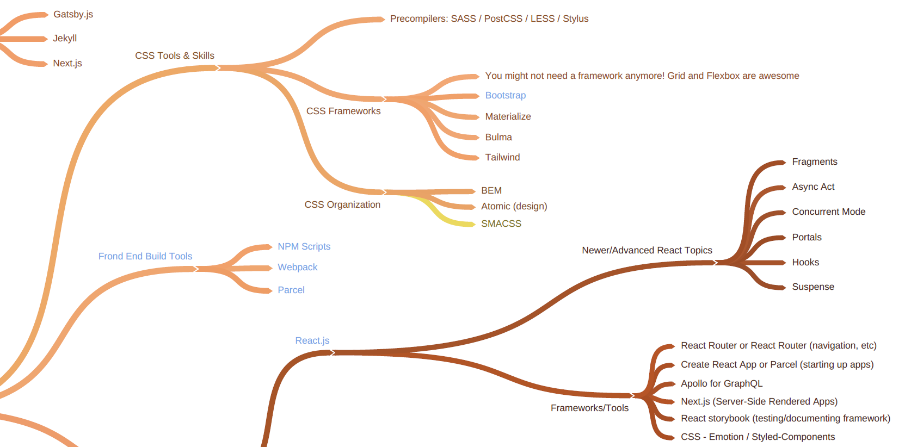

# Configure React, Webpack, Babel, Tailwind, and Express

> A special thank to [Traversy
> Media](https://www.youtube.com/c/TraversyMedia/videos) for tons of
> learning materials. 😄

## Goal

The repo is my own reflection after I have learned how to configure
`React`, `Webpack`, `Babel`, `Tailwind`, `Express` and bundle them with
`R`.

<!-- -->

<details>

<summary> References </summary>
<a href="https://www.youtube.com/watch?v=SBB1YtwODT0">Web Development in
2020 - A complete roadmap</a>

</details>

## Folder structure

    #> .
    #> +-- client
    #> +-- frontend.PNG
    #> +-- node_modules
    #> +-- package-lock.json
    #> +-- package.json
    #> +-- README.md
    #> +-- README.Rmd
    #> +-- server.js
    #> +-- stpacker.Rproj
    #> \-- st_frontend

## Procedures

Procedures are created after watching relevant YouTube videos. Their
links will be mentioned as references.

### Node

Download nodejs from [nodejs.org](https://nodejs.org/en/download/).  
Create a RStudio project.

```` markdown
```{r}
system2("npm", c("-v"))
system2("node", c("-v"))
Sys.which("npm")
```
````

<details>

<summary> References </summary>
<a href="https://www.youtube.com/watch?v=jHDhaSSKmB0">NPM Crash Course
2017</a><br>

</details>

### Express

Create server-side `package.json` and install dependencies in the
project folder.

```` markdown
```{r}
system2("npm", c("init -y"))
system2("npm", c("i", "express", "concurrently"))
system2("npm", c("i", "-D", "nodemon"))
```
````

Modify server-side `package.json`.

1.  `"start": "node server.js"`,
2.  `"server": "nodemon server.js"`,
3.  `"client": "npm start --prefix client"`,
4.  `"dev": "concurrently \"npm run server\" \"npm run client\""`,

Create `server.js` and run express server (`ctrl + c` stop it).

```` markdown
```{r}
system2("touch", "server.js")
system2("npm", c("run", "server"))
```
````

<details>

<summary> References </summary>
<a href="https://www.youtube.com/watch?v=L72fhGm1tfE">Express JS Crash
Course 2019</a><br>
<a href="https://www.youtube.com/watch?v=v0t42xBIYIs">React & Express
Starter Pack 2018</a>

</details>

### React

Go to RStudio terminal.

1.  `mkdir client`,
2.  `cd client`,

You can use `npx create-react-app .` to create a react app.  
I don’t want to download all those stuffs. I will do the followings to
create a react app.

1.  `npm init` create client-side `package.json`,
2.  `npm i react react-dom react-scripts` install dependencies.
3.  `mkdir public` and `touch index.html`
4.  `mkdir src` and `touch index.js app.js`

Create components.

1.  `cd src && mkdir components`,
2.  `cd components && touch customers.js`,
3.  `app.js` link to `customers.js`,
4.  `cd ..` back to `client` folder,

<details>

<summary> References </summary>
<a href="https://www.youtube.com/watch?v=sBws8MSXN7A">React JS Crash
Course 2019</a>

</details>

### Tailwind

1.  `npm i -D tailwindcss postcss-cli autoprefixer` install
    dependencies,
2.  `npx tailwind init tailwind.js --full` initialize tailwind,
3.  `touch postcss.config.js` create postcss configuration,
4.  `cd src && mkdir assets`
5.  `touch tailwind.css main.css`
6.  `cd ..`

Modify client-side `package.json`.

1.  `browserslist` added to `package.json`,
2.  `proxy` added to it,
3.  `"start": "npm run watch:css && react-scripts start"`,
4.  `"build": "npm run build:css && react-scripts build"`,
5.  `"build:css": "postcss src/assets/tailwind.css -o
    src/assets/main.css"`,
6.  `"watch:css": "postcss src/assets/tailwind.css -o
    src/assets/main.css"`,
7.  `npm start`

<details>

<summary> References </summary>
<a href="https://www.youtube.com/watch?v=FiGmAI5e91M">React & Tailwind
CSS 2020</a>

</details>

### Webpack

**It does not show in this case**. You can download the folder from
[here]() and run `npm install` to work.

Install dependencies;

1.  `npm i -D webpack webpack-dev-server webpack-cli`,
2.  `npm i -D babel-core babel-loader babel-preset-env
    babel-preset-react`,
3.  `npm i -D html-webpack-plugin html-loader`,
4.  `npm i -D css-loader style-loader`,

Modify `package.json`;

1.  `npm start`: `"start": "webpack-dev-server --mode development --open
    --hot"`,
2.  `npm run build`: `"build": "webpack --mode production"`,

Create `webpack.config.js`;

1.  entry: `index.js`,  
2.  output: `bundle.js` inside of `dist`,
3.  loaders: babel. html, css,  
4.  plugins `html-webpack-plugin`: automatically create `index.html`

<details>

<summary> References </summary>
<a href="https://www.youtube.com/watch?v=deyxI-6C2u4">React & Webpack 4
From Scratch - No CLI</a><br>
<a href="https://www.youtube.com/watch?v=lziuNMk_8eQ">Webpack Crash
Course 2017</a><br>
<a href="https://github.com/babel/babel-loader/issues/616">Cannot find
module ‘babel-preset-env’</a><br>
<a href="https://www.robinwieruch.de/minimal-react-webpack-babel-setup">Set
up React, Webpack, Babel 2019</a><br>
<a href="https://www.valentinog.com/blog/babel/">Tutorial set up React,
webpack, Babel 2020</a>

</details>

### Concurrently

Back to the project folder and run.

```` markdown
```{r}
system2("npm", c("run", "dev"))
```
````

## Bundle into an R package

1.  R script in the `inst` folder to share everything but
    `node_modules`,
2.  R wrapper function to call `npm install` in the package installation
    folder `system.file(package)`,
3.  `system2` from R to run node scripts,

<details>

<summary> References </summary>
<a href="https://colinfay.me/node-r-package/">ColinFay |
node-minify</a><br>
<a href="https://github.com/JohnCoene/packer">JohnCoene | packer</a><br>
<a href="https://shiny.rstudio.com/articles/js-send-message.html">Shiny
msg from the browser to the server</a><br>
<a href="https://shiny.rstudio.com/articles/js-build-widget.html">Shiny
build a JavaScript based widget</a>

</details>

## Interesting reads

[V8](https://github.com/jeroen/V8),
[Websocket](https://github.com/rstudio/websocket).  
[chrome-remote-interface](https://github.com/cyrus-and/chrome-remote-interface),
[puppeteer JS](https://github.com/puppeteer/puppeteer),
[crrri](https://rlesur.github.io/crrri/), [puppeteer
Py](https://github.com/miyakogi/pyppeteer).  
[reactR](https://github.com/react-R/reactR),
[vueR](https://github.com/vue-r/vueR),
[Reactor](https://github.com/herbps10/reactor).
